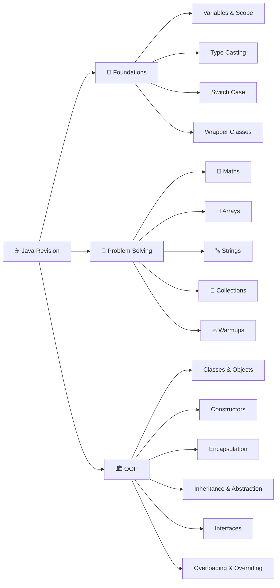

<div align="center">

# ☕ September 2026 Java Revision

### A focused, hands-on notebook for mastering Java fundamentals, problem solving, collections, and OOP.

<p>
  <a href="https://github.com/Sameer-Programmer/2026_Sep_Java_Rivision"></a>
  
  
  
</p>

<p>
  <a href="./src/main/java">📂 Browse source</a>
  ·
  <a href="./pom.xml">⚙️ View Maven config</a>
  ·
  <a href="https://github.com/Sameer-Programmer/2026_Sep_Java_Rivision">⭐ Visit repository</a>
</p>

</div>

---

> **Learning by implementation:** small, executable examples make each concept easy to read, run, modify, and understand.

## 🧭 About this project

This repository is a practical Java revision notebook built from focused examples and nearby study notes. It progresses from language fundamentals and algorithmic problem solving into collections and object-oriented programming.

The project is intentionally maintained as learning material rather than a production application. Class names and a few original spelling variations are retained to preserve the progression of the revision sessions.

## 🗺️ Learning map



## 📚 What is covered

The examples currently include **103 Java source files** plus supporting notes across the following areas:

| Icon | Area | Package(s) | Focus |
| :---: | --- | --- | --- |
| 🧱 | Java foundations | `foundation.Maths_Problems`, `foundation.SwitchCase_Example`, `foundation.TypeCating_Example` | Variables, scope, type casting, `switch`, prime numbers, Fibonacci, factorial, Armstrong numbers, GCD, perfect numbers, powers, leap years, and number manipulation |
| 📦 | Array concepts | `foundation.Arrays_Concept` | Array declarations, traversal, and arrays of objects |
| 🔁 | Array problems | `foundation.Arrays_Problems` | Searching, copying, sorting, rotations, two-sum, missing values, duplicates, non-repeated values, maximum sums, averages, products, and even/odd separation |
| 🧺 | Collections concepts | `foundation.Collections_Concept` | `ArrayList`, `HashSet`, and `HashMap` basics |
| 🧮 | Collections problems | `foundation.Collections_Problems` | Removing duplicates, moving zeroes, merging arrays, frequency counting, majority elements, shuffling, common elements, and partitioning values |
| 🔤 | String problems | `foundation.Strings` | Reversal, character separation, duplicates, frequency counting, anagrams, substrings, word comparisons, swapping, whitespace cleanup, capitalization, and conversion |
| 🔥 | Warmups | `foundation.Warmup` | Duplicate detection, rotations, maximum sums, target subarrays, binary search, minimum values, and string-to-number conversion |
| 🔄 | Wrapper classes | `foundation.ConceptWrapperClass` | Java wrapper types and conversions such as `Integer.parseInt` |
| 🛡️ | Exception handling | `foundation.conceptExeception` | `try`, `catch`, `finally`, `throw`, `throws`, checked exceptions, unchecked exceptions, and catch ordering |
| 🧩 | Classes and objects | `oops.Class_Method_Obj` | Basic classes, methods, objects, and simple domain examples |
| 🏗️ | Constructors | `oops.Concepts_Constructer` | Default and parameterized constructors and object initialization |
| 🔒 | Encapsulation | `oops.Concepts_Encapsulation` | Private state with getters and setters using a `Bank` example |
| 🌳 | Inheritance | `oops.Concepts_Inheritance` | Parent-child relationships and inherited behavior |
| 🧠 | Abstraction | `oops.ConceptAbstraction` | Abstract-class and abstract-behavior notes and examples |
| 🔀 | Overloading and overriding | `oops.Concepts_MethodOverLoading_Riding` | Compile-time overloading, runtime overriding, and static method hiding |
| ⬆️ | `super` keyword | `oops.SuperkeyWord` | Parent constructors, methods, fields, and initialization behavior |
| 🔐 | Access and final keywords | `oops.AccessModifiers`, `oops.finalKeyWord` | Access control and the use of `final` |
| 🔌 | Interfaces | `oops.interfaceConcepts` | Interface notes, differences, and implementation examples |

## 🗂️ Project structure

```text
Sep_2026_Practice/
├── pom.xml
├── README.md
└── src/main/java/
    ├── foundation/
    │   ├── Arrays_Concept/
    │   ├── Arrays_Problems/
    │   ├── Collections_Concept/
    │   ├── Collections_Problems/
    │   ├── ConceptWrapperClass/
    │   ├── Maths_Problems/
    │   ├── Strings/
    │   ├── SwitchCase_Example/
    │   ├── TypeCating_Example/
    │   ├── Warmup/
    │   └── conceptExeception/
    └── oops/
        ├── AccessModifiers/
        ├── Class_Method_Obj/
        ├── ConceptAbstraction/
        ├── Concepts_Constructer/
        ├── Concepts_Encapsulation/
        ├── Concepts_Inheritance/
        ├── Concepts_MethodOverLoading_Riding/
        ├── SuperkeyWord/
        ├── finalKeyWord/
        └── interfaceConcepts/
```

## 🚀 Getting started

### ✅ Prerequisites

- **JDK 21**, as configured in `pom.xml`
- **Maven 3.9+** for the Maven workflow
- IntelliJ IDEA, Eclipse, or Visual Studio Code with Java support

### ⚙️ Compile with Maven

From the repository root:

```bash
cd Sep_2026_Practice
mvn clean test
```

This is a collection of standalone examples and does not currently contain a JUnit test suite. Maven is used primarily to compile the project and check that the source tree is wired correctly.

### ▶️ Run an individual exercise

Run any class that contains a `main` method. For example:

```bash
cd Sep_2026_Practice
mkdir -p out
javac -d out src/main/java/foundation/Maths_Problems/Test003_PrimeNumberCheck.java
java -cp out foundation.Maths_Problems.Test003_PrimeNumberCheck
```

For examples that depend on other source files, compile the complete source tree through Maven or configure `src/main/java` as the source root in your IDE.

## 🪜 Suggested revision order

1. **Start with foundations** — variables, scope, type casting, wrapper classes, and `switch` statements.
2. **Strengthen logic** — mathematical problems, loops, conditions, arithmetic, and input reasoning.
3. **Master arrays** — concepts, searching, sorting, rotations, duplicates, and subarray problems.
4. **Practice strings and collections** — indexing, mutability, equality, frequency counting, and duplicate handling.
5. **Build the OOP foundation** — classes, objects, constructors, encapsulation, access modifiers, and `final`.
6. **Complete the OOP path** — inheritance, abstraction, interfaces, overloading, overriding, and `super`.
7. **Test your understanding** — change inputs and add edge cases such as empty values, single-element arrays, duplicates, negative numbers, and already-sorted data.

## 💡 Practice approach

For every exercise:

1. Write down the expected output.
2. Trace the program line by line.
3. Change the input and test an edge case.
4. Refactor for readability after the solution is correct.
5. Consider whether the algorithm or data structure can be simplified.

The repository contains both executable Java examples and plain-text revision notes. Notes are kept near related examples so that concepts and code can be studied together.

## 🔗 Quick links

| Resource | Link |
| --- | --- |
| 🏠 Repository | [2026_Sep_Java_Rivision](https://github.com/Sameer-Programmer/2026_Sep_Java_Rivision) |
| 📂 Java source tree | [`src/main/java`](./src/main/java) |
| ⚙️ Maven configuration | [`pom.xml`](./pom.xml) |

## ⚠️ Current limitations

- There are no automated unit tests yet; `mvn test` primarily serves as a compilation check.
- Some filenames and package names retain historical spelling and capitalization choices from the practice sessions.
- No license file is currently included. Add an appropriate license before redistributing the code publicly or incorporating it into another project.

---

<div align="center">

### ⭐ Keep learning. Keep building. Keep revising.

<sub>Built as a practical Java revision notebook.</sub>

</div>
