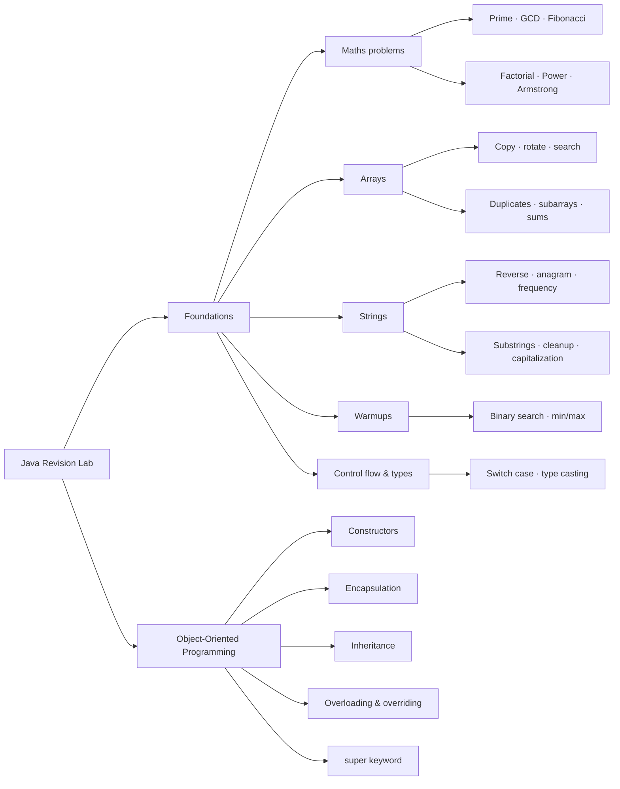

# Java Revision Lab

<div align="center">

  <h2>September 2026 Java Practice</h2>
  <p>A focused collection of small, executable Java programs for rebuilding core programming fundamentals and object-oriented thinking.</p>

  <p>
    <a href="https://github.com/Sameer-Programmer/2026_Sep_Java_Rivision/tree/sameer/Sep_2026_Practice">Explore the practice module</a>
    ·
    <a href="https://github.com/Sameer-Programmer/2026_Sep_Java_Rivision/tree/sameer/Sep_2026_Practice/src/main/java">Browse source code</a>
  </p>

  <p>
    
    
    
    
  </p>

</div>

> **Learning by implementation:** each class is intentionally small, readable, and easy to run in isolation. Use the examples to understand a concept, then modify the inputs and implementation to test your own understanding.

## What this repository covers

This module moves from language fundamentals to practical problem solving and object-oriented programming. The examples include variable scope, type casting, conditional logic, loops, arrays, strings, mathematical algorithms, constructors, encapsulation, inheritance, method overloading, method overriding, and the `super` keyword.

The source is arranged by concept rather than by application layer, which makes it useful as a revision index: choose a topic, open a class, run its `main` method, and inspect the result.

## Learning map



## Project structure

```text
Sep_2026_Practice/
├── pom.xml
├── README.md
└── src/
    └── main/
        └── java/
            ├── Foundation/
            │   ├── Arrays_Problems/
            │   ├── Maths_Problems/
            │   ├── Strings/
            │   ├── SwitchCase_Example/
            │   ├── TypeCating_Example/
            │   └── Warmup/
            └── Oops/
                ├── Concepts_Constructor/
                ├── Concepts_Encapsulation/
                ├── Concepts_Inheritance/
                ├── Concepts_MethodOverLoading_Riding/
                └── SuperkeyWord/
```

## Topic guide

| Area | Package | Representative practice |
|---|---|---|
| Mathematical problem solving | `Foundation.Maths_Problems` | Prime checks, GCD, Fibonacci, factorial, powers, Armstrong numbers, leap years, swapping, counting, and largest-number exercises |
| Array problem solving | `Foundation.Arrays_Problems` | Copying arrays, rotations, duplicate detection, and array transformations |
| String problem solving | `Foundation.Strings` | Reversal, character separation, duplicate removal, frequency counting, anagrams, substrings, and capitalization |
| Algorithm warmups | `Foundation.Warmup` | Binary search, minimum and maximum values, target sums, duplicate discovery, and subarray problems |
| Language foundations | `Foundation.SwitchCase_Example`, `Foundation.TypeCating_Example` | `switch`-based control flow and type-casting examples |
| Constructors | `Oops.Concepts_Constructor` | Default and parameterized constructors, object initialization, and constructor behavior |
| Encapsulation | `Oops.Concepts_Encapsulation` | Private state with getters and setters through a simple `Bank` example |
| Inheritance | `Oops.Concepts_Inheritance` | Parent-child relationships and inherited behavior |
| Overloading and overriding | `Oops.Concepts_MethodOverLoading_Riding` | Compile-time overloading and runtime overriding, including static-method behavior |
| `super` keyword | `Oops.SuperkeyWord` | Parent constructors, parent methods, parent fields, and initialization blocks |

## Quick start

### Prerequisites

- **JDK 21** or a compatible newer JDK
- **Maven 3.9+** if you want to use the project descriptor from the command line
- An IDE such as IntelliJ IDEA, Eclipse, or Visual Studio Code with Java support

### Compile with Maven

From this directory:

```bash
cd Sep_2026_Practice
mvn clean test
```

The project currently contains standalone examples rather than a JUnit test suite, so `test` primarily verifies that the source compiles successfully.

### Run an individual exercise

Each example with a `main` method can be run independently. For example:

```bash
cd Sep_2026_Practice
javac -d out src/main/java/Foundation/Maths_Problems/Test003_PrimeNumberCheck.java
java -cp out Foundation.Maths_Problems.Test003_PrimeNumberCheck
```

For a multi-file IDE workflow, mark `src/main/java` as the source root and run the `main` method from the class you want to study.

## Suggested revision path

1. Start with declarations, variables, type casting, `switch`, and simple mathematical exercises.
2. Continue with arrays and strings to practice loops, indexing, conditions, and common transformations.
3. Use the warmup problems to compare straightforward solutions with more efficient approaches such as binary search.
4. Study constructors and encapsulation before moving into inheritance.
5. Finish with overloading, overriding, static method dispatch, and the `super` keyword.
6. For every exercise, change the input values and add at least one edge case before moving on.

## How to use this repository effectively

The class names preserve the progression of the practice sessions, including a few original spelling variations. Treat those names as part of the learning history rather than renaming them while revising. Keep experiments local to a class, write down the expected output before running it, and compare the result with the implementation line by line.

When revisiting an exercise, try to improve it in three passes: first make it correct, then make the intent easier to read, and finally consider whether the algorithm can be simplified or made more efficient. This keeps the repository useful both as a record of practice and as a growing reference library.

## Repository navigation

- [Parent repository](https://github.com/Sameer-Programmer/2026_Sep_Java_Rivision)
- [Practice source tree](./src/main/java)
- [Maven configuration](./pom.xml)

## License

No license file is currently included in this module. Add a license before redistributing the code publicly or incorporating it into another project.

---

<div align="center">
  <sub>Built as a practical Java revision notebook.</sub>
</div>
